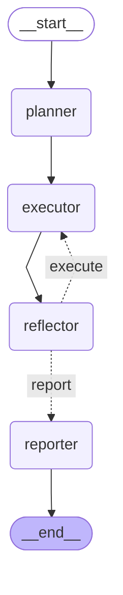

# CreditIQ Agent Logic

```mermaid
---
config:
  flowchart:
    curve: linear
---
graph TD;
	__start__([<p>__start__</p>]):::first
	planner(planner)
	executor(executor)
	reflector(reflector)
	reporter(reporter)
	__end__([<p>__end__</p>]):::last
	__start__ --> planner;
	executor --> reflector;
	planner --> executor;
	reflector -. &nbsp;execute&nbsp; .-> executor;
	reflector -. &nbsp;report&nbsp; .-> reporter;
	reporter --> __end__;
	classDef default fill:#f2f0ff,line-height:1.2
	classDef first fill-opacity:0
	classDef last fill:#bfb6fc

```